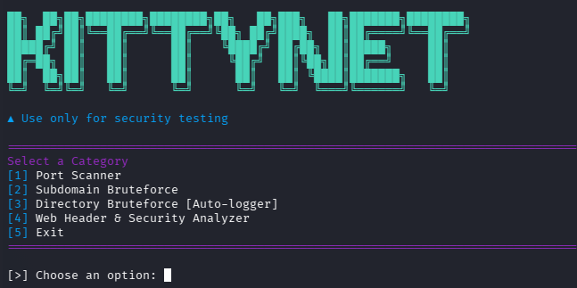

# KITTYNET

[](LICENSE)



KITTYNET is a CLI multitool written in Python for basic network and web resource security testing.

> **WARNING:** This tool is created for educational purposes only. Use it only on systems you have explicit permission to test.

## Features

* **[1] Port Scanner** — Fast TCP port scanner.
* **[2] Subdomain Bruteforce** — Dictionary-based subdomain finder.
* **[3] Directory Bruteforce** — Web path scanner with auto-logging.
* **[4] Web Header & Security Analyzer** — HTTP security headers analysis.
* Dual-language interface support (RU / EN).

## Installation

```bash
git clone https://github.com/Qumaqwe/kittynet.git
cd kittynet
pip install -r requirements.txt
```

## Usage

```bash
python main.py
```

Select your language and the desired tool by following the console prompts.

## License

This project is licensed under the MIT License. See the [LICENSE](LICENSE) file for details.